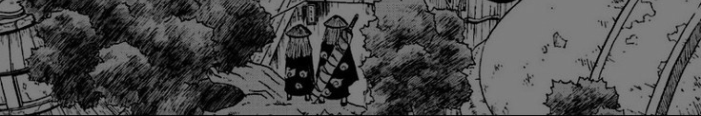

 

Portuguese coffee lover, full-stack developer and self-taught graphic designer, focused on creating efficient software solutions and impactful applications. I write clean, maintainable code while combining creativity and technical skills to craft visually appealing designs. Passionate about user-centered development, I aim to deliver innovative projects that add real value, constantly seeking opportunities to grow and contribute to open-source communities. I’m also planning to study software engineering in the future.

<b>"You have to be lost to find your way."</b> – <i>Alphonse Elric</i>

