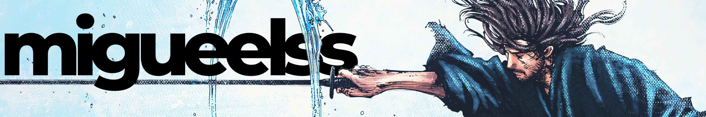
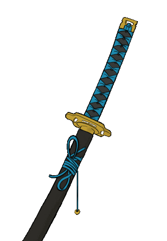

 

  
  
  
  
  
  
  

21-year-old Portuguese author, self-taught graphic designer, and full-stack developer. I love crafting compelling stories, designing visually stunning graphics, and building dynamic software solutions using technologies like JavaScript, Python, React, and Node.js. Combining creativity with technical skills, I strive to deliver impactful and innovative projects.

<h3 align="center">I work mainly with</h3>

       

